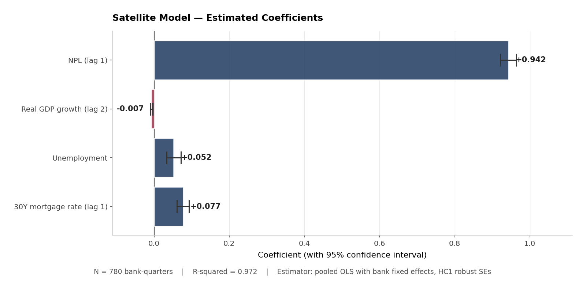
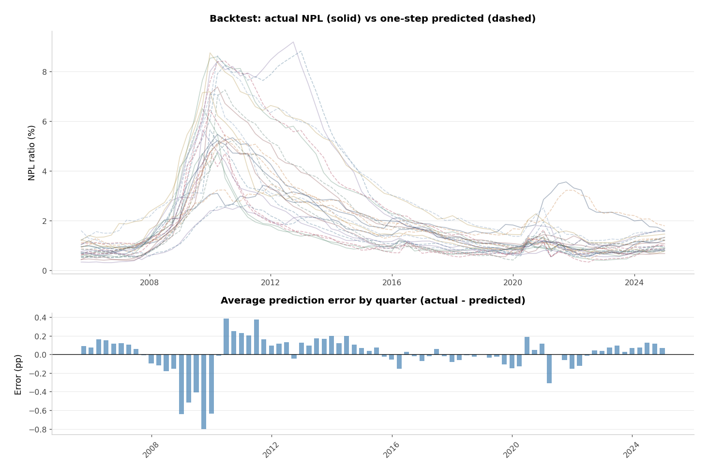
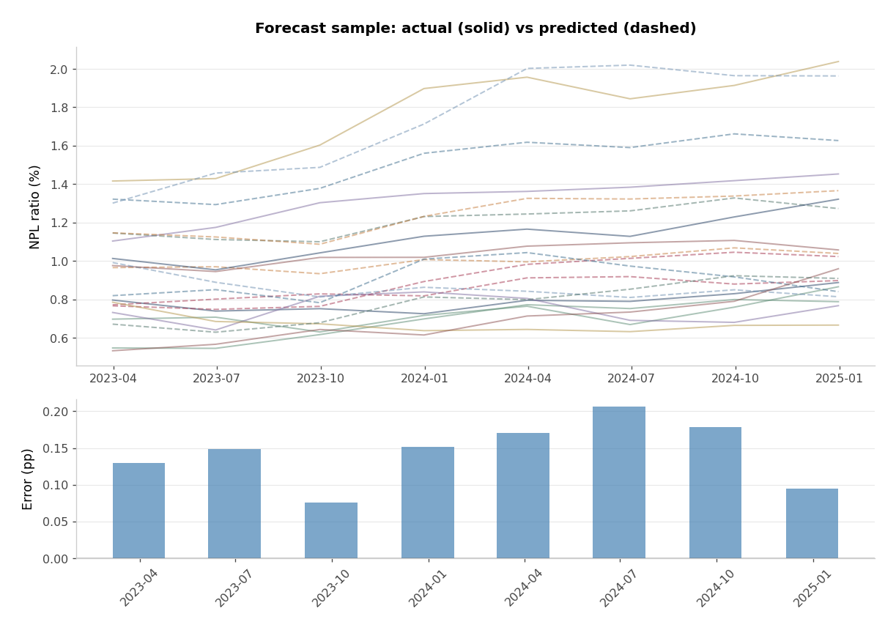
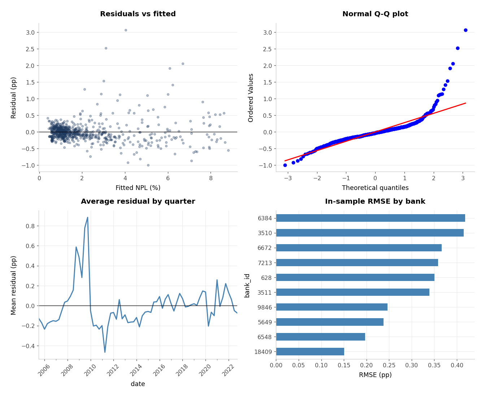
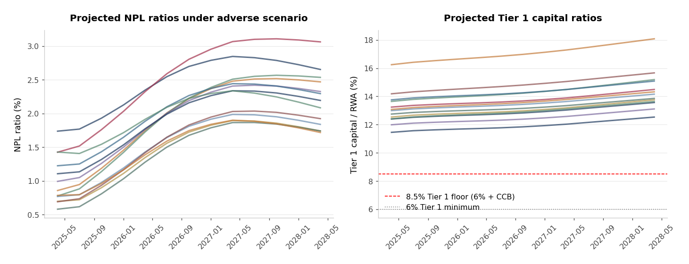

# Top-Down Credit Stress Test for Large U.S. Banks

> A reduced-form macro stress test of credit risk across ten large US banks. Built as a portfolio project to demonstrate satellite modeling, validation, and capital projection methodology used in supervisory stress testing.
>

**Methods:** panel fixed-effects regression · HC1 robust standard errors · Phillips-Perron and Zivot-Andrews unit root tests · out-of-sample validation · VIF and Ljung-Box diagnostics
**Data:** FDIC BankFind API · FRED · Fed DFAST scenario files
**Stack:** Python · statsmodels · pandas · matplotlib

---

## Headline result

The 2025 Fed severely adverse scenario applied to ten large US banks over a nine-quarter horizon:

| Metric | Value |
|---|---:|
| Total system credit loss | $36.0B |
| Median trough Tier 1 ratio | 13.4% |
| Most stressed bank (trough) | PNC, 12.0% |
| Least stressed bank (trough) | Regions, 17.1% |
| Banks breaching 8.5% Tier 1 floor | 0 of 10 |
| In-sample RMSE | 0.31 pp |
| Out-of-sample RMSE | 0.17 pp |

Capital metric is Tier 1 / RWA (a CET1 proxy — see [Stress test results](#stress-test-results)). The 8.5% threshold is the 6% Tier 1 minimum plus a 2.5% conservation buffer. All numbers reproduce from `python examples/run_all.py`.

---

## Pipeline

```
FDIC call reports      FRED macro history       2025 Fed scenario
       │                       │                        │
       └───────────┬───────────┘                        │
                   ▼                                    │
        Estimation panel (780 obs)                      │
                   │                                    │
                   ▼                                    │
        Satellite NPL model                             │
        (panel FE + AR(1) + macro)                      │
                   │                                    │
                   ▼                                    │
        Validation suite (12 PASS, 4 WARN)              │
                   │                                    │
                   └───────────┬────────────────────────┘
                               ▼
                  Nine-quarter NPL projection
                               │
                               ▼
                  Capital roll-forward
                  (NPL → losses → equity → ratio)
```

---

## How banks actually stress credit (and what this project does instead)

Walk into a large bank's risk team and ask how they stress credit. You will hear about **probability of default (PD)**, **loss given default (LGD)**, and **exposure at default (EAD)**, often modeled at the loan or facility level with rating migrations and IFRS 9 stage allocation driving provisions. CCAR and DFAST go further: segment-level models for CRE, cards, mortgages, and C&I, with collateral and prepayment dynamics, all shocked under a supervisory macro scenario. That bottom-up stack is the production system.

This project is **not** that. It is a **top-down satellite model** of the kind supervisors and central banks use when they need to link a macro scenario to bank-level credit outcomes without full loan-level data. The NPL ratio enters directly as a function of lagged NPL and a small set of macro variables. Losses are backed out with a fixed LGD. The capital module rolls equity forward from pre-provision income minus credit losses. All inputs are public.

---

## The workflow

1. **Build the panel.** Pull quarterly financials for ten US banks from the FDIC and merge with FRED macro history.
2. **Estimate the satellite.** Regress each bank's NPL ratio on its own lag, GDP growth, unemployment, and mortgage rates, with bank fixed effects.
3. **Validate.** Backtest in sample, forecast out of sample on 2023-2024, run standard regression diagnostics, and check unit roots.
4. **Project.** Feed the 2025 Fed severely adverse scenario through the model, convert NPL paths into losses, and roll capital forward.

---

## Data

### Banks and the credit metric

Ten large US banks. Quarterly data from the [FDIC BankFind API](https://banks.data.fdic.gov/docs/) (free, no key). After the first download, results are cached locally.

The dependent variable is the **NPL ratio** from call report fields:

$$\text{NPL ratio (\\%)} = \frac{\text{NCLNLS}}{\text{LNLSNET}} \times 100$$

`NCLNLS` is noncurrent loans and leases. `LNLSNET` is net loans and leases. A coarse but standard portfolio-level credit quality measure.

| CERT | Bank |
|---:|---|
| 628 | JPMorgan Chase Bank NA |
| 3510 | Bank of America NA |
| 3511 | Wells Fargo Bank NA |
| 7213 | Citibank NA |
| 6548 | U.S. Bank NA |
| 6384 | PNC Bank NA |
| 9846 | Truist Bank |
| 5649 | Fifth Third Bank NA |
| 6672 | KeyBank NA |
| 18409 | Regions Bank |

### Macro variables

Bundled in `data/fred_macro_history.csv` so the project runs without a FRED API key. The final model uses four regressors; the panel includes a wider set for specification testing.

| Variable | FRED series | Used in final model |
|---|---|:---:|
| Real GDP growth | A191RL1Q225SBEA | Yes (lag 2) |
| Unemployment | UNRATE | Yes (contemporaneous) |
| 30-year mortgage rate | MORTGAGE30US | Yes (lag 1) |
| 3-month T-bill | TB3MS | No |
| CPI inflation | CPIAUCSL | No |
| House price index | CSUSHPINSA | No |

Panel: **2005 Q1 to 2024 Q4** (80 quarters per bank). After attaching two lags, **780 bank-quarters** remain for estimation.

### Stress scenario

The **2025 Fed supervisory severely adverse domestic scenario** (`data/2025-Table_3A_Supervisory_Severely_Adverse_Domestic.csv`). Bank history ends 2024 Q4. Scenario path starts 2025 Q1 and runs nine quarters, matching the DFAST planning horizon.

---

## The satellite model

### Specification

$$
\text{NPL}_{i,t} = \alpha_i + \rho\,\text{NPL}_{i,t-1} + \beta_1\,\text{GDP}_{t-2} + \beta_2\,\text{UR}_{t} + \beta_3\,\text{Mtg}_{t-1} + \varepsilon_{i,t}
$$

The lagged NPL term captures persistence — credit quality does not reset every quarter. GDP enters at lag 2 (weaker growth shows up in delinquencies with a delay). Unemployment is contemporaneous. The mortgage rate enters with one lag, proxying for household debt-service pressure.

Estimation is pooled OLS with bank dummies and **HC1 robust standard errors**. Bank fixed effects only — no time fixed effects, so common macro shocks enter through the regressors rather than through time dummies.

### How I got to this specification

I did not start with four variables. The first pass included two lags of GDP, unemployment, and short rates on top of lagged NPL. That fit well in sample but was too rich for ten banks. I dropped variables and lags step by step, checking forecast stability and coefficient signs at each stage. GDP worked better at lag 2 than lag 1. Contemporaneous unemployment beat a lagged term. The mortgage rate added more than the T-bill alone. HPI, CPI, and the T-bill were dropped from the final spec.

That iterative trimming is normal in satellite model development. The goal is a stable, interpretable mapping from scenario to NPL that a validator can challenge — not the highest in-sample R-squared.

### Estimated coefficients (full panel, 780 obs.)



**How to read.** Each bar is a regression coefficient. The horizontal whisker is its 95% confidence interval. Navy bars are positive (variables that push NPL up), burgundy bars are negative (variables that push NPL down). No interval crosses zero, meaning every coefficient is statistically significant.

| Variable | Coef. | Std. err. | Sign | Reading |
|---|--:|--:|:---:|---|
| `npl_lag1` | 0.942 | 0.011 | + | NPL is highly persistent |
| `real_gdp_growth_lag2` | -0.007 | 0.002 | - | Weaker growth raises NPL with delay |
| `unemployment` | 0.052 | 0.010 | + | Higher unemployment raises NPL |
| `mortgage_rate_lag1` | 0.077 | 0.008 | + | Higher rates raise NPL with one-quarter lag |

R-squared 0.972. All coefficients significant at 1%. Signs match credit-cycle intuition.

---

## Model validation

Validation matters as much as estimation. The project includes a `validate_model()` function that produces a structured report with automated PASS, WARN, and FAIL flags. I treat WARN seriously — a flag does not mean the model is broken, but I would discuss it in a validation memo.

### What the validator checks

Economic plausibility (do coefficient signs make sense?), statistical fit, multicollinearity, residual diagnostics, in-sample backtest error, out-of-sample forecast error, and a separate flag for GFC-period fit. Code in `stresskit/validation.py`.

```python
from stresskit import SatelliteNPLModel, validate_model

model = SatelliteNPLModel().fit(estimation_panel)
report = validate_model(
    model,
    full_panel,
    est_end="2022-12-31",
    oos_start="2023-03-31",
    oos_end="2024-12-31",
)
report.print_summary()
report.save("data/")
```

**Validation summary (estimation through 2022 Q4): 12 PASS, 4 WARN, 0 FAIL.**

| Check | Status | Detail |
|---|:---:|---|
| Coefficient signs | PASS | All four regressors signed as theory suggests |
| Significance | PASS | All p-values below 1% |
| R-squared | PASS | 0.972 |
| In-sample RMSE | PASS | 0.32 pp |
| Out-of-sample RMSE | PASS | 0.17 pp |
| Out-of-sample bias | PASS | +0.14 pp, model slightly under-predicts |
| Heteroskedasticity | PASS | Breusch-Pagan rejects, HC1 SEs used |
| Durbin-Watson | WARN | 1.12, some positive autocorrelation |
| Ljung-Box | WARN | Serial correlation in residuals |
| Residual normality | WARN | Fat tails, driven by the GFC |
| Multicollinearity | WARN | Unemployment VIF = 10.7 |
| GFC period RMSE | WARN | 0.75 pp in 2008-2009 vs 0.11 pp in 2015-2019 |

The warnings are honest. A linear AR model with ten banks is not going to fit the GFC well, and unemployment correlates with lagged NPL by construction. In a bank validation I would document these points and test challenger specifications (crisis dummy, shorter estimation window, alternative unemployment transform). I would not hide them.

---

## Does the model track realized NPL?

### In-sample backtest

At each quarter, can the model predict that quarter's NPL using only information available up to the prior quarter? Overall error is **0.31 pp RMSE** and **0.18 pp MAE**.

| Bank | RMSE (pp) | MAE (pp) |
|---|---:|---:|
| Regions | 0.14 | 0.11 |
| U.S. Bank | 0.19 | 0.13 |
| Fifth Third | 0.23 | 0.18 |
| Truist | 0.24 | 0.16 |
| Wells Fargo | 0.33 | 0.19 |
| JPMorgan Chase | 0.34 | 0.20 |
| Citibank | 0.35 | 0.21 |
| KeyBank | 0.35 | 0.18 |
| Bank of America | 0.40 | 0.26 |
| PNC | 0.40 | 0.18 |



**How to read.** Top panel: each colored line is one bank, solid = actual NPL, dashed = one-step prediction. Where they stay close, the model is tracking realized credit quality. Bottom panel: average prediction error by quarter. Errors cluster around the Global Financial Crisis, when a linear model without a regime switch cannot capture the speed of deterioration.

**RMSE by sub-period:**

| Period | RMSE (pp) |
|---|---:|
| 2005-2007 | 0.20 |
| 2008-2009 | 0.75 |
| 2010-2014 | 0.29 |
| 2015-2019 | 0.11 |
| 2020-2022 | 0.18 |

The GFC row is the one I would spend the most time on in a model review.

### Out-of-sample forecast (2023 Q1 to 2024 Q4)

In-sample fit can always be engineered. A more informative test: estimate through **2022 Q4**, forecast **2023 Q1 to 2024 Q4** (80 bank-quarters).

| Metric | Value |
|---|---:|
| RMSE | 0.17 pp |
| MAE | 0.16 pp |
| Bias | +0.14 pp |

The model **under-predicts** realized NPL by 0.14 pp on average. NPL ticked up modestly in 2024 and the satellite, anchored on high persistence, lagged that turn slightly.

| Quarter | Actual NPL (%) | Predicted (%) | Error (pp) |
|---|---:|---:|---:|
| 2023 Q1 | 0.86 | 0.99 | +0.13 |
| 2023 Q2 | 0.84 | 0.99 | +0.15 |
| 2023 Q3 | 0.91 | 0.98 | +0.08 |
| 2023 Q4 | 0.96 | 1.11 | +0.15 |
| 2024 Q1 | 1.01 | 1.18 | +0.17 |
| 2024 Q2 | 0.97 | 1.18 | +0.21 |
| 2024 Q3 | 1.02 | 1.20 | +0.18 |
| 2024 Q4 | 1.08 | 1.17 | +0.09 |



**How to read.** Top: actual (solid) vs predicted (dashed) NPL in the holdout window. The lines track each other more closely than during the GFC, which is why OOS RMSE is lower than full-sample in-sample RMSE. Bottom: quarter-by-quarter bias. The flip from positive to negative bias in 2024 is worth flagging in a validation report even though overall RMSE looks good.

### Regression diagnostics

Standard econometric health check on residuals from the 2022 Q4 estimation window.



- **Residuals vs fitted:** Should scatter randomly around zero. Breusch-Pagan rejects homoskedasticity, which is why HC1 robust standard errors are used.
- **Q-Q plot:** Upper tail deviates from the diagonal — the GFC fat tail. Jarque-Bera rejects normality.
- **Average residual by quarter:** Systematic errors in particular periods. The GFC stands out again.
- **RMSE by bank:** Bank of America and PNC have the largest in-sample errors, consistent with the backtest table.

| Variable | VIF |
|---|---:|
| `npl_lag1` | 3.9 |
| `real_gdp_growth_lag2` | 1.1 |
| `unemployment` | 10.7 |
| `mortgage_rate_lag1` | 6.4 |

Unemployment VIF above 10 reflects correlation with lagged NPL. I would monitor coefficient stability across rolling windows before relying on that point estimate in a live stress test.

### Unit root tests

Before relying on NPL in levels I checked stationarity with Phillips-Perron and Zivot-Andrews tests (`arch` package). Bank NPL ratios do not reject a unit root in levels for most institutions. GDP growth is stationary. Unemployment is borderline.

This supports including the AR term. First-differencing NPL would remove the level information stress testers care about. Supervisors want the projected **level** of NPL under an adverse path, not just the change.

---

## Stress test results

I feed the **2025 Fed severely adverse scenario** through the satellite starting from each bank's 2024 Q4 position. The satellite produces a nine-quarter NPL path. The capital module converts NPL increases into losses and rolls **Tier 1 regulatory capital** forward against **risk-weighted assets**.

```
new NPLs (dollars)   = max(change in NPL ratio, 0) x net loans
credit loss          = new NPLs x LGD (45%)
net income           = PPNR - credit loss
tier 1 capital       = tier 1 capital + net income
capital ratio        = tier 1 capital / RWA
```

PPNR is a flat quarterly ROA (0.10% under stress vs 0.30% baseline). RWA is held flat through the horizon. No dividends, no capital raises.

### Why Tier 1 / RWA and not CET1 directly

CET1 / RWA is the headline ratio in CCAR / DFAST scoring. The FDIC BankFind API silently drops the CET1 fields (a known quirk — same issue we hit with the NPL ratio field), so I use **Tier 1 / RWA** as a CET1 proxy. For the ten large US banks in this panel, CET1 and Tier 1 differ by less than 0.5 percentage points across the entire post-Basel-III history, because they hold negligible non-CET1 Tier 1 instruments (e.g., AT1). The methodology, the projection logic, and the policy interpretation are identical.

The **8.5% threshold** is the regulatory 6% Tier 1 minimum plus the 2.5% capital conservation buffer. Below that, banks face restrictions on dividends and discretionary bonuses.

| Bank | Trough T1 (%) | End T1 (%) | Total credit loss | Breach 8.5% floor? |
|---|---:|---:|---:|:---:|
| PNC | 11.98 | 13.12 | $1.9B | No |
| Fifth Third | 12.15 | 13.26 | $0.4B | No |
| Truist | 12.74 | 13.87 | $1.7B | No |
| KeyBank | 12.99 | 14.17 | $0.6B | No |
| Wells Fargo | 13.24 | 14.51 | $6.3B | No |
| Bank of America | 13.64 | 15.21 | $8.4B | No |
| U.S. Bank | 13.75 | 15.10 | $2.0B | No |
| Citibank | 14.18 | 15.68 | $3.7B | No |
| JPMorgan Chase | 16.16 | 18.06 | $10.3B | No |
| Regions | 17.11 | 18.75 | $0.8B | No |



**How to read.** Left: projected NPL ratios. NPL roughly doubles over the horizon for most banks — the satellite's response to the macro path (rising unemployment, falling GDP, higher rates). Right: Tier 1 capital ratio. The red dashed line is the 8.5% effective floor (6% minimum + 2.5% conservation buffer); the gray dotted line is the bare 6% Tier 1 minimum. Capital ratios drift up because PPNR exceeds losses under these assumptions — a known simplification, not a finding about real bank resilience. A full DFAST-style projection would include RWA growth, balance sheet rebalancing, and often declining PPNR under stress.

In a real bank this stage would sit on top of hundreds of PD/LGD models by segment, with provisions flowing through the ECL framework and capital measured against full CET1, Tier 1 leverage, and SLR ratios. Here the point is to show that the satellite output connects to a regulatory capital narrative, not to replicate CCAR.

---

## Extension roadmap

If I were taking this from a class project to a production-style exercise, these would be my priorities:

1. **Replace the NPL satellite with a PD-based segment structure** (CRE, cards, C&I, residential) if loan-level or segment data were available.
2. **Add risk-weighted capital** instead of equity over total assets.
3. **Model PPNR properly** (NII satellite with repricing gaps, not a flat ROA).
4. **Add a crisis regime** (dummy or threshold) so the GFC is not treated like a normal draw.
5. **Expand the bank sample** or stratify by asset size and business model.

Every simplification above is visible in the code as a named parameter. That is intentional. Stress testing is as much about assumptions as it is about econometrics.

---

## Running the project

Requires Python 3.10+ and the packages in `requirements.txt`. The first run downloads FDIC data over the internet and caches it locally.

```bash
git clone https://github.com/muhammadumarshinwari/top-down-credit-stress-test-large-us-banks.git
cd top-down-credit-stress-test-large-us-banks
pip install -r requirements.txt
python examples/run_all.py
```

That single command runs the stress test, out-of-sample forecast, validation suite, unit root tests, and PDF report. Each stage can also be run separately from the `examples/` folder. Key outputs land in `data/` (CSVs) and `docs/` (charts and `US_Bank_Credit_Stress_Test.pdf`).

---

*Educational project built entirely on public data. Not supervisory software; outputs are not assessments of any real bank's credit quality, provisions, or capital adequacy.*
